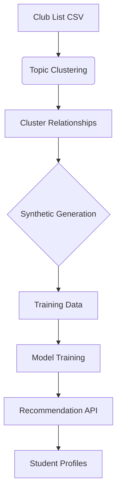

# Anchor - Student Club Recommendation System

## System Overview
A machine learning system for generating personalized club recommendations using semantic clustering and synthetic data generation. Combines topic modeling with synthetic profile generation to create training data for recommendation models.

### Key Components
1. **Topic Clustering Engine** (`src/models/cluster.py`)
2. **Synthetic Data Generator** (`src/models/data.py`)
3. **Embedding System** (`src/models/embeddings.py`)
4. **Training Pipeline** (`src/train.py`)
5. **Configuration System** (`src/utils/config.py`)

## Architecture Deep Dive

### 1. Topic Clustering (BERTopic Implementation)
```python
# From cluster.py
class TopicCluster:
    id: int
    topic_name: str
    clubs: List[str]
    embedding: np.ndarray
    similar_topics: List[int]

# Custom pipeline components
umap_model = UMAP(n_components=5, min_dist=0.1)
hdbscan_model = HDBSCAN(min_cluster_size=4, prediction_data=True)
vectorizer = CountVectorizer(stop_words=list(CUSTOM_STOPWORDS))
```

**Key Features:**
- Custom stopword list for club descriptions
- HDBSCAN clustering with UMAP dimensionality reduction
- Cosine similarity for topic relationships
- Cluster metadata persistence in `.cache/`

### 2. Synthetic Data Generation
```python
# From data.py
class ClubCombination:
    primary_clubs: List[str]
    secondary_clubs: List[str]
    primary_topic_id: int
    secondary_topic_id: int
    topic_similarity: float

# Generation process
combinations = generator.generate_combinations(
    n_combinations=config.data.num_samples,
    primary_clubs_per_combo=config.data.primary_clubs_per_combo,
    secondary_clubs_per_combo=config.data.secondary_clubs_per_combo
)
```

**Data Structure:**
```json
{
  "primary_clubs": ["Club Golf", "Board Game Club"],
  "secondary_clubs": ["Honors Neighborhood"],
  "primary_topic": {"id": 0, "name": "or + people + space"},
  "topic_similarity": 0.521,
  "club_descriptions": {
    "Club Golf": "We are a club that revolves around...",
    "Board Game Club": "The Board Game Club is intended for..."
  }
}
```

### 3. Model Training
**Configuration (`config.py`):**
```python
@dataclass
class TrainConfig:
    epochs: int = 50
    batch_size: int = 32
    learning_rate: float = 5e-5
    patience: int = 15
    use_cache: bool = True
```

**Training Process:**
1. Load pre-computed embeddings
2. Train siamese network on club combinations
3. Early stopping with 15-epoch patience
4. Model serialization to `models/`

---

## Improvement Roadmap

### 1. Questionnaire Structure
**Current Implementation:**
- Static synthetic profiles with:
  - Free time allocation
  - College purpose statements
  - Happiness descriptors
  - Hobby lists

**Proposed Enhancements:**
```python
# Suggested schema additions
class EnhancedQuestionnaire(SyntheticProfile):
    academic_interests: List[str] = Field(max_items=3)
    social_preference: Literal["small", "medium", "large"] = "medium"
    time_commitment: Literal["low", "medium", "high"] = "medium"
    skill_development: List[str] = Field(max_items=2)
```

### 2. Synthetic Data Generation
**Current Approach:**
- Topic-based combination generation
- Random sampling with similarity constraints
- Basic validation rules

**Improvement Opportunities:**
1. Add cross-topic compatibility matrices
2. Implement GAN-based profile generation
3. Introduce temporal dynamics for activity patterns
4. Add conflict rules for incompatible club pairs

### 3. Real Student Data Integration
**Implementation Strategy:**
```python
# Proposed data ingestion flow
def ingest_real_data(student_records: List[StudentProfile]):
    anonymized = anonymize(student_records)
    augmented = combine_with_synthetic(anonymized)
    validate_dataset(augmented)
    update_training_pipeline(augmented)
```

**Considerations:**
- FERPA-compliant data handling
- Differential privacy for sensitive attributes
- Hybrid training (synthetic + real data)

### 4. Model Architecture
**Current Stack:**
- BERTopic for clustering
- Sentence Transformers (all-MiniLM-L6-v2)
- Basic feedforward recommendation model

**Proposed Enhancements:**
1. Implement two-tower model architecture
2. Add attention mechanisms for combination weighting
3. Introduce temporal modeling for activity sequences
4. Add explainability module using SHAP values

---

## Development Setup

```bash
# Poetry-based installation
poetry install
poetry run python -m spacy download en_core_web_sm

# Environment configuration
export AWS_REGION="us-east-1"
export AWS_ACCESS_KEY_ID="your_key"
export AWS_SECRET_ACCESS_KEY="your_secret"
```

**Workflow Commands:**
```bash
# Generate clusters
poetry run cluster --config fast_test

# Generate synthetic data
poetry run data --samples 2000

# Full training pipeline
poetry run pipeline --epochs 100 --batch-size 64
```

---

## Data Flow Diagram



## Performance Considerations
1. Embedding cache invalidation strategy
2. Batch processing for large datasets
3. Quantized model serving
4. Cluster similarity pre-computation

## Monitoring
Suggested metrics tracking:
```python
metrics = {
    'cluster_stability': calculate_topic_consistency(),
    'generation_diversity': entropy_score(combinations),
    'model_performance': {
        'ndcg@5': 0.82,
        'coverage': 0.95,
        'novelty': 0.67
    }
}
```